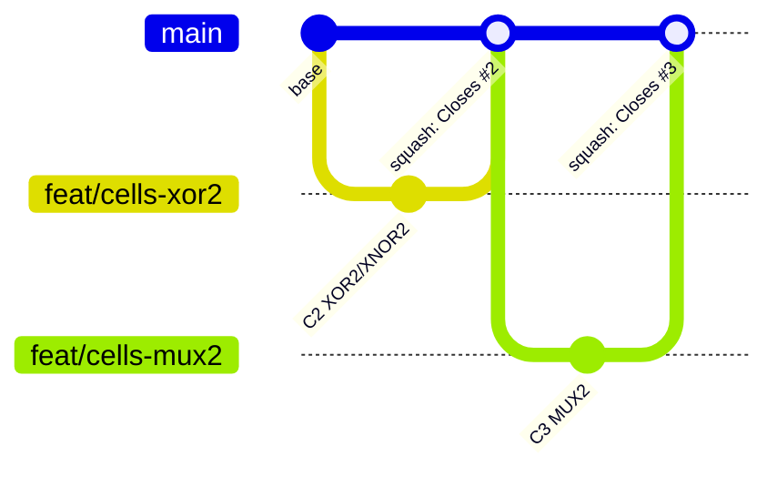

# Cómo contribuir

## Primer día

```bash
git clone https://github.com/Hector-0-0/transim754.git
cd transim754
git config user.name "Su Nombre Completo"
git config user.email "correo-de-su-cuenta-de-github@ejemplo.com"
make install          # crea .venv, instala dependencias y los ganchos de pre-commit
make test             # todo en verde o como pendiente (x)
```

1. Lea la GUIA de su módulo (enlaces en [EQUIPO.md](EQUIPO.md)) y los ADR que cita.
2. Haga un primer commit pequeño para comprobar su flujo, por ejemplo corregir una errata
   de su GUIA o agregar una pregunta de comprensión, en una rama propia y con PR.

Requisitos: Python 3.12, `make` y git. En Windows use WSL o Git Bash.

## Identidad y autoría

- Cada integrante commitea con **su propio nombre y su correo de GitHub**, configurados
  en su clon (`git config user.name` / `user.email`).
- Los mensajes de commit no llevan trailers `Co-Authored-By` ni menciones a
  herramientas de asistencia.
- Antes de cada push, verifique el autor: `git log --format='%an <%ae>' -5`.

## Ramas y flujo

- `main` está protegida: solo se integra mediante pull request.
- Cada issue se trabaja en una rama `feat/<ámbito>-<descripcion-corta>`, por ejemplo
  `feat/cells-xor2` o `feat/fpu-addsub-normalizacion`. Para errores: `fix/<ámbito>-…`.
- Mantenga su rama al día: `git fetch origin && git rebase origin/main`.



## Convención de commits

Formato (Conventional Commits, en español):

```
<tipo>(<ámbito>): <resumen en imperativo, minúscula, ≤ 72 caracteres, sin punto>

[cuerpo opcional: qué y por qué]

[pie: Refs #N | Closes #N]
```

- **Tipos:** `feat`, `fix`, `test`, `docs`, `refactor`, `perf`, `chore`, `ci`, `build`.
- **Ámbitos:** `repo`, `core`, `cells`, `blocks`, `alu`, `fpu-common`, `fpu-addsub`,
  `fpu-muldiv`, `cpu`, `metrics`, `ai`, `cli`, `gui`, `docs`, `research`, `reference`.
- Ejemplos: `feat(cells): agrega XOR CMOS de 12 transistores`,
  `test(fpu-addsub): agrega casos de subnormales contra numpy`.

## Cuándo commitear

- Un commit por paso lógico con las pruebas en verde. Los **puntos de commit** de cada
  GUIA (C1, C2, …) definen los pasos y el mensaje sugerido.
- Nunca se commitea con pruebas rotas: el gancho de pre-commit ejecuta ruff y las
  pruebas rápidas del módulo modificado.
- Al implementar una parte, **quite los `@pendiente(N)`** de sus pruebas: si la prueba
  pasa y el marcador sigue, la suite falla (XPASS estricto) para recordárselo.

## Pull requests

1. Al cerrar el último punto de commit de un issue, abra un PR hacia `main` con la
   plantilla y `Closes #N`.
2. La integración continua (ruff, mypy y pruebas rápidas) debe estar en verde.
3. Se requiere **una aprobación** de otro integrante (asignada por CODEOWNERS).
4. Se integra con **squash merge** y un mensaje convencional con `Closes #N`.
5. Al cerrar cada hito, el líder técnico crea un tag anotado y un release, y actualiza
   `CHANGELOG.md`.

## Definition of Done

Una tarea está terminada cuando:

- [ ] Las pruebas del módulo pasan y no queda ningún `@pendiente` propio.
- [ ] `make validar M=<modulo>` da **PASS** (con `COMPLETO=1` si la GUIA lo pide).
- [ ] `make lint` y `make typecheck` sin errores.
- [ ] Docstrings completos en todo lo público.
- [ ] GUIA del módulo y bitácora del equipo actualizadas.
- [ ] Registro de uso de IA actualizado si se usó (política en `docs/06_politica_ia.md`).
- [ ] Métricas regeneradas (`make metrics`) si cambió el hardware.
- [ ] Revisado y aprobado por otro integrante.

## Reglas de diseño

- No se cambian interfaces (firmas, nombres de celda, puertos) sin un ADR nuevo en
  `docs/adr/`.
- No se modifica código de otro módulo: si hace falta, se abre un issue al responsable.
- Ninguna dependencia nueva sin ADR (ADR-0011).
- Los parámetros del formato (8, 23, 32, 127) solo se escriben en `fpu/format.py` y
  `cpu/isa.py` (ADR-0001); una prueba lo verifica.
- Idioma: español en documentación, commits y comentarios; identificadores en inglés.
