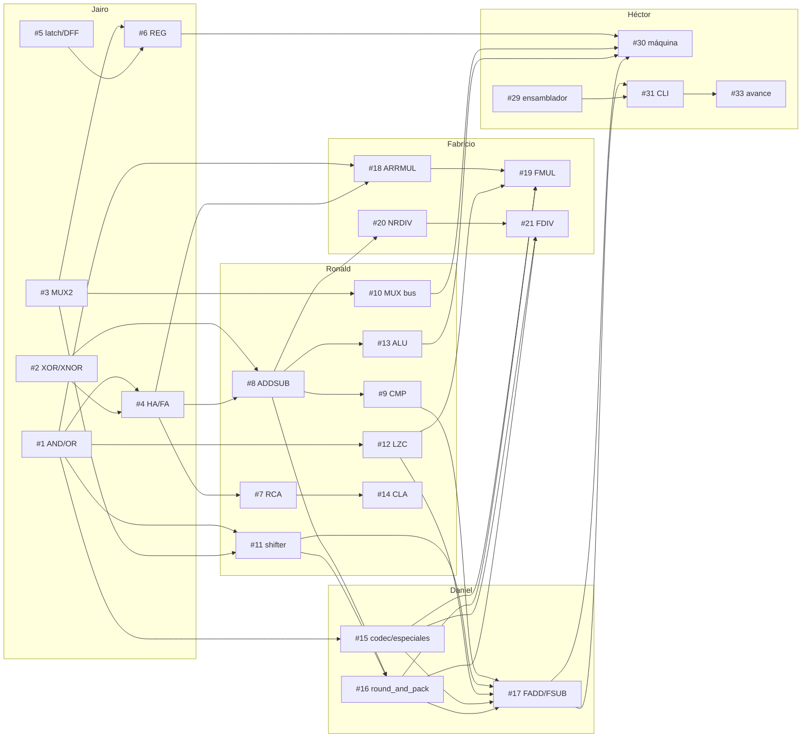

# Equipo

Proyecto del procesador con transistores simulados · SI421U · UNI-FIIS · 2026-II ·
Docente: Carlos Nelson Ramos Montes.

## Integrantes y responsabilidades

| Integrante | GitHub | Responsabilidad | Guía | Issues |
|---|---|---|---|---|
| Héctor David Flores Sánchez | [@Hector-0-0](https://github.com/Hector-0-0) | Líder técnico e integrador: base, núcleo L0, CPU, ensamblador, CLI, asistente, revisión de PR y releases | [cpu](src/transim/cpu/GUIA.md), [assistant](src/transim/assistant/GUIA.md) | #29–#33 |
| Jairo Jhosimar Huaman Choque | [@JairoHCh](https://github.com/JairoHCh) | Celdas L1: AND, OR, XOR, XNOR, MUX2, HA, FA espejo, latch, flip-flop, registro | [cells](src/transim/cells/GUIA.md) | #1–#6 |
| Matthews Ronald Ayala Zubilete | [@devronaldaz](https://github.com/devronaldaz) | Bloques L2 y ALU: RCA, CLA, restador, comparador, multiplexores, barrel shifter, LZC, ALU entera | [blocks](src/transim/blocks/GUIA.md), [alu](src/transim/alu/GUIA.md) | #7–#14 |
| Daniel | *pendiente* | FPU común y FADD/FSUB: codec, casos especiales, redondeo RNE (dueño de `rounding.py`), suma y resta | [fpu addsub](src/transim/fpu/GUIA_ADDSUB.md) | #15–#17 |
| Fabricio | [@Fabrizzio-07](https://github.com/Fabrizzio-07) | FPU FMUL/FDIV: multiplicador en arreglo, divisor no restaurador | [fpu muldiv](src/transim/fpu/GUIA_MULDIV.md) | #18–#21 |
| Yenny | [@yennyestherchavez](https://github.com/yennyestherchavez) | GUI, métricas, investigación "transistores en las CPU", diapositivas e informe APA | [metrics](src/transim/metrics/GUIA.md), [gui](src/transim/ui/gui/GUIA.md), [investigación](docs/investigacion/transistores_en_cpus.md) | #22–#28 |

## Dependencias entre tareas

Nadie espera a otro para empezar: cada módulo se desarrolla contra su interfaz (stub) y
se prueba con los modelos de `src/transim/reference/` y con las celdas semilla (INV,
NAND2, NOR2). Cuando la dependencia real llega a `main`, las mismas pruebas validan la
integración.

## Calendario hacia el avance

| Día | Actividad |
|---|---|
| Jue 8 oct | Base del repositorio (F0–F3). |
| **Vie 9 oct** | Base (F4–F6). Cada integrante: clona, configura su identidad git, `make install`, `make test`, lee su GUIA y hace un primer commit pequeño (ver CONTRIBUTING, "Primer día"). Daniel y Fabricio acuerdan el contrato de `round_and_pack`. |
| Sáb 10 oct | Implementación de módulos en paralelo; PR por issue. |
| Dom 11 oct | Integración de FADD/FSUB en transistores, demo, documento de propuesta, diapositivas y ensayo. |
| **Lun 12 oct** | **Presentación del avance**; tag `v0.1.0-avance`. |

Hitos: `v0.1.0-avance` (2026-10-12), `v0.5.0-parcial` (fecha por confirmar),
`v1.0.0-final` (fecha por confirmar).

## Cómo validar cada parte

| Parte | Comando | Debe decir |
|---|---|---|
| Todo (rápido) | `make test` | todas las pruebas en verde o como pendientes (`x`) |
| Celdas | `make validar M=cells` | `RESULTADO: PASS` |
| Bloques | `make validar M=blocks` | `RESULTADO: PASS` |
| ALU | `make validar M=alu` | `RESULTADO: PASS` |
| FADD/FSUB | `make validar M=fpu-addsub COMPLETO=1` | `RESULTADO: PASS` |
| FMUL/FDIV | `make validar M=fpu-muldiv COMPLETO=1` | `RESULTADO: PASS` |
| Métricas | `make validar M=metrics` | `RESULTADO: PASS` |
| GUI | `make validar M=gui` | `RESULTADO: PASS` |
| CPU / CLI / asistente | `make validar M=cpu` · `M=cli` · `M=ai` | `RESULTADO: PASS` |

`python scripts/validar.py --lista` muestra todos los módulos con sus issues.
