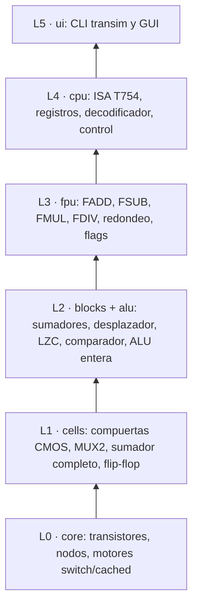

# TranSim754

Procesador con transistores simulados: una FPU IEEE 754 (binary32) y una ALU entera
construidas desde transistores nMOS/pMOS sobre un simulador switch-level escrito en
Python.

Proyecto del curso Arquitectura de Computadoras y Sistemas Operativos (SI421U),
Universidad Nacional de Ingeniería, FIIS, 2026-II.

[](https://github.com/Hector-0-0/transim754/actions/workflows/ci.yml)

## Qué es

- Cada transistor es un interruptor (nMOS conduce con compuerta en 1, pMOS con 0) en
  un simulador de cuatro valores lógicos (0, 1, X, Z) y tres fuerzas.
- Con esos transistores se construyen compuertas CMOS, sumadores, desplazadores, una
  ALU entera de 32 bits y una FPU que suma, resta, multiplica y divide en IEEE 754-2019
  binary32 con redondeo al par más cercano, subnormales, ±0, ±∞, NaN y los cinco flags.
- Una CPU mínima con ISA propia (T754) ejecuta programas ensamblados desde texto.
- Los resultados se verifican bit a bit contra numpy; se miden transistores,
  conmutaciones y profundidad lógica.

## Demo en 3 comandos

```bash
git clone https://github.com/Hector-0-0/transim754.git && cd transim754
make install
make demo        # transim calc 1.5 + 2.25 --format binary32 --trace
```

> Estado (v0.1.0-avance): FADD, FSUB, FMUL y FDIV se calculan en transistores en binary32
> y binary16; `transim calc`, `asm`, `run`, `metrics` y `gui` funcionan.

Requisitos: Python 3.12 y `make`. La GUI necesita además `make install-gui`.

## Arquitectura



## Documentación

| Documento | Contenido |
|---|---|
| [Propuesta (avance)](docs/00_propuesta.md) | problema, objetivos, alcance, decisiones, plan y cronograma |
| [Arquitectura](docs/01_arquitectura.md) | capas L0–L5 y recorrido de una FADD |
| [Simulador switch-level](docs/02_simulador_switch_level.md) | modelo del transistor y algoritmo |
| [IEEE 754](docs/03_ieee754.md) | formatos, redondeo, flags y 6 ejemplos resueltos bit a bit |
| [ISA T754](docs/04_isa_t754.md) | instrucciones, codificación y ensamblador |
| [Métricas](docs/05_metricas.md) | transistores, actividad y camino crítico |
| [Política de IA](docs/06_politica_ia.md) | uso de IA en el software y en el desarrollo |
| [ADR](docs/adr/README.md) | las 13 decisiones de diseño |
| [Glosario](docs/GLOSARIO.md) | términos técnicos |
| [Investigación](docs/investigacion/transistores_en_cpus.md) | transistores en las CPU |
| [Equipo](EQUIPO.md) · [Cómo contribuir](CONTRIBUTING.md) | organización y flujo de trabajo |

## Equipo

Héctor David Flores Sánchez (líder técnico), Daniel, Jairo, Ronald, Fabricio y Yenny.
Docente: Carlos Nelson Ramos Montes.

## Licencia

[MIT](LICENSE)
