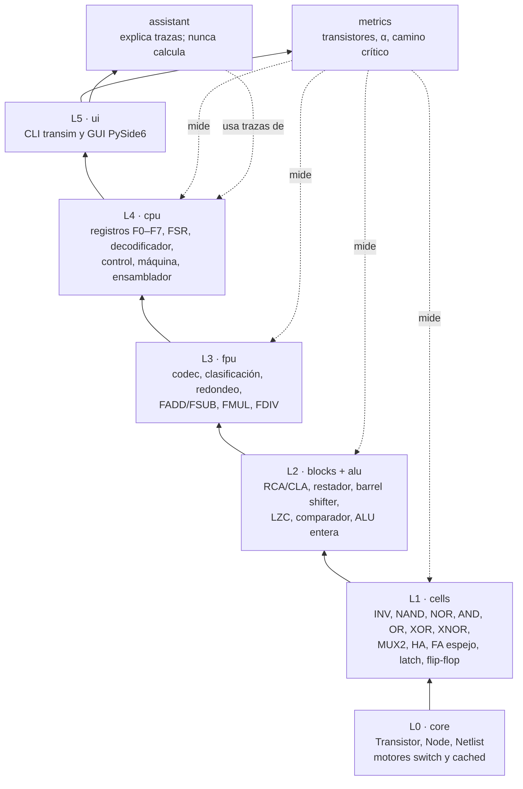
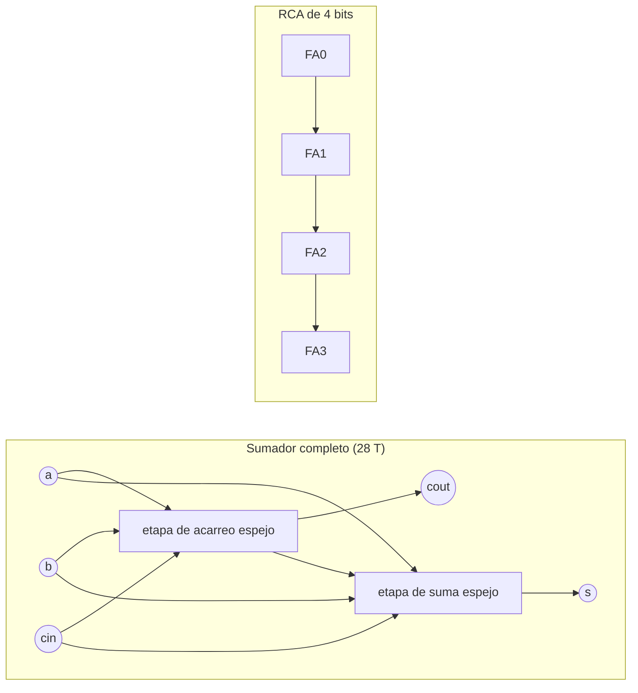
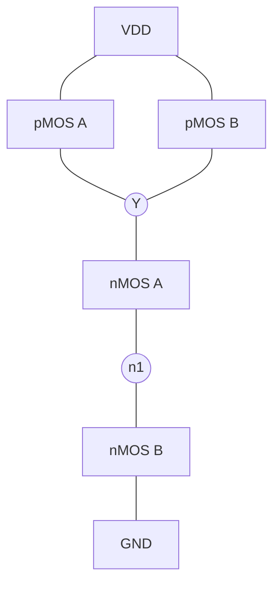
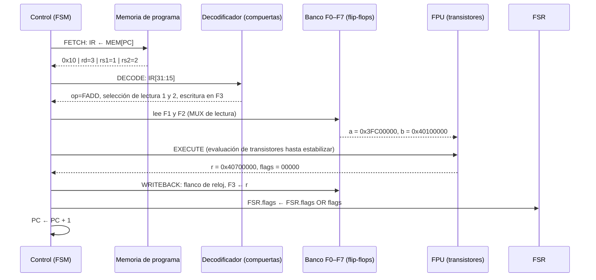
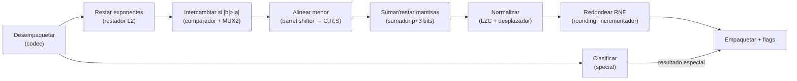
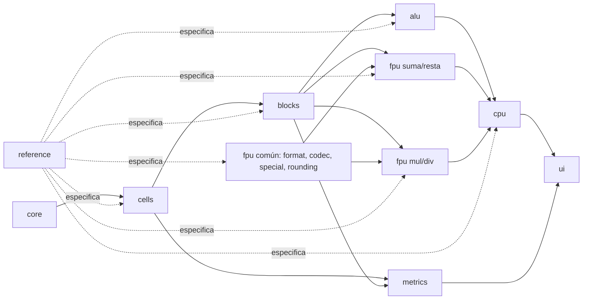

# 01 · Arquitectura de TranSim754

## 1. Visión por capas

El sistema se organiza en seis capas. Cada capa solo usa las capas inferiores, y cada
una tiene un **modelo de referencia** en Python puro (`src/transim/reference/`) que
define su comportamiento esperado y sirve de oráculo en las pruebas.

| Capa | Paquete | Unidad primitiva | Construida con |
|---|---|---|---|
| L0 | `core` | transistor nMOS/pMOS | Python (simulador) |
| L1 | `cells` | celda CMOS | transistores |
| L2 | `blocks`, `alu` | bloque aritmético | celdas L1 |
| L3 | `fpu` | unidad de punto flotante | bloques L2 y celdas L1 |
| L4 | `cpu` | procesador | L3, L2, flip-flops; control según ADR-0006 |
| L5 | `ui` | interfaz | — |

## 2. El netlist jerárquico

Todo circuito es un `Netlist`: una lista de transistores y nodos con **puertos con
nombre** (entradas y salidas) y **buses** (listas ordenadas de nodos, con el bit 0 como
LSB). Un netlist puede **instanciar** otro como subcircuito, conectando sus puertos a
nodos propios. Al simular, la jerarquía se aplana a transistores, pero se conserva la
pertenencia de cada transistor a su instancia para contar transistores por módulo y
calcular la profundidad en niveles de celda.

## 3. Interacción de los transistores en una compuerta

En CMOS estático cada compuerta tiene una red **pull-up** de pMOS hacia VDD y una red
**pull-down** de nMOS hacia GND, complementarias: para cualquier combinación de entradas
exactamente una de las dos conduce. Ejemplo, NAND2 (4 transistores):

- A = B = 1: ambos nMOS conducen (Y conectado a GND) y ambos pMOS están abiertos → Y = 0.
- Cualquier entrada en 0: al menos un pMOS conduce (Y conectado a VDD) y la pila nMOS
  está cortada → Y = 1.
- El nodo interno `n1` queda aislado cuando B = 0 y A = 0: retiene su carga anterior.
  Este es el fenómeno que obliga al motor `cached` a incluir el estado interno en su
  tabla (ADR-0008).

## 4. Recorrido completo de una instrucción FADD

Programa: `FADD F3, F1, F2` con F1 = 1.5 (`0x3FC00000`) y F2 = 2.25 (`0x40100000`).

Dentro de la FPU, la operación atraviesa estas etapas, todas construidas con
transistores (ver el cálculo bit a bit en `docs/03_ieee754.md`, ejemplo 2):

| Etapa | Bloque | Valores en el ejemplo |
|---|---|---|
| Desempaquetar | `fpu.codec` | a: s=0, e=0, m=1.1000…; b: s=0, e=1, m=1.0010… |
| Clasificar | `fpu.special` | ambos normales → camino numérico |
| Restar exponentes | `blocks.subtractor` | 1 − 0 = 1 |
| Intercambiar | `blocks.comparator` + `blocks.mux` | b es el mayor → no se intercambia el orden lógico |
| Alinear | `blocks.shifter` (derecha, con sticky) | m_a → 0.1100…, G=R=S=0 |
| Sumar | `blocks.adders` | 1.0010… + 0.1100… = 1.1110… |
| Normalizar | `blocks.lzc` + `blocks.shifter` | ya normalizado |
| Redondear | `fpu.rounding` | GRS = 000 → sin incremento, exacto |
| Empaquetar | `fpu.codec` | `0x40700000`, flags 00000 |

## 5. Dependencias entre módulos y trabajo en paralelo

Cada módulo de alto nivel puede desarrollarse antes de que existan sus dependencias en
transistores, porque su interfaz y su comportamiento esperado ya están fijados por los
stubs y por `reference/`. La integración final reemplaza el modelo de referencia por la
implementación en transistores, y las mismas pruebas validan ambos.
