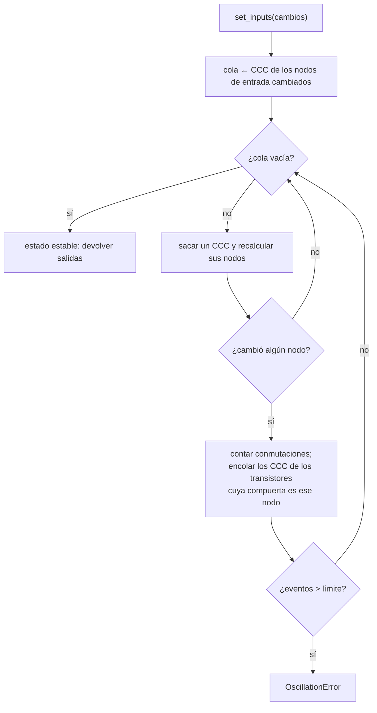

# 02 · Simulador switch-level

Este documento describe el núcleo L0 (`src/transim/core/`): cómo se representan los
transistores y los nodos, y cómo se calcula el valor de cada nodo. Las decisiones están
en ADR-0007 (modelo) y ADR-0008 (motores).

## 1. Modelo

### 1.1 Valores y fuerzas

| Valor | Significado |
|---|---|
| `0` | nivel bajo |
| `1` | nivel alto |
| `X` | desconocido o en conflicto |
| `Z` | alta impedancia: sin fuente y sin carga conocida |

| Fuerza | Origen | Orden |
|---|---|---|
| `SUPPLY` | rieles VDD (1) y GND (0) | mayor |
| `DRIVEN` | entradas del circuito puestas por el usuario | media |
| `CHARGE` | carga retenida por un nodo aislado | menor |

Una señal es el par (valor, fuerza). Cuando una fuente de mayor fuerza alcanza un nodo,
anula a las de menor fuerza; dos fuentes de igual fuerza y valores opuestos producen X.

### 1.2 Transistores

Cada transistor tiene tres terminales: compuerta (`gate`), `source` y `drain`. Al ser un
interruptor bidireccional ideal, `source` y `drain` son intercambiables.

| Tipo | gate = 0 | gate = 1 | gate = X o Z |
|---|---|---|---|
| nMOS | abierto | conduce | conducción desconocida |
| pMOS | conduce | abierto | conducción desconocida |

Simplificación declarada: no se modela la caída de umbral V_t. Un nMOS que conduce un
1, en hardware real, entrega V_DD − V_t (un "1 débil"); aquí entrega un 1 de la misma
fuerza que su fuente. En CMOS estático complementario esto no altera ningún valor
lógico, porque los 1 los transmiten los pMOS y los 0 los nMOS.

## 2. Algoritmo de evaluación

### 2.1 Componentes conectados por canal (CCC)

Dos nodos pertenecen al mismo CCC si existe un camino entre ellos formado por
transistores que conducen o que **podrían** conducir. Los rieles VDD y GND, y los nodos
de entrada, actúan como **fuentes** y cortan el CCC: no se propaga a través de ellos.

### 2.2 Cálculo del valor de un nodo

Para un CCC se construyen dos grafos:

- `G_on`: aristas = transistores que conducen con certeza;
- `G_maybe`: aristas = transistores que conducen con certeza o posiblemente.

En cada grafo, para cada nodo *n*:

1. Se reúnen las fuentes alcanzables desde *n*: rieles (`SUPPLY`), entradas
   (`DRIVEN`) y la carga de los nodos alcanzables (`CHARGE`).
2. Se toma la **fuerza máxima** presente.
3. Si todas las fuentes de esa fuerza tienen el mismo valor, ese es el valor de *n*; si
   hay 0 y 1, el valor es X.
4. Si no hay ninguna fuente, *n* conserva su valor previo con fuerza `CHARGE`.

El valor final es el de `G_on` si coincide con el de `G_maybe`; si no, **X**. La
intuición: si la conducción incierta puede cambiar el resultado, el resultado es
desconocido.

### 2.3 Propagación dirigida por eventos



El modelo es de **retardo cero**: no hay tiempo físico, solo un orden de eventos hasta
alcanzar un estado estable.

### 2.4 Situaciones especiales

| Situación | Resultado | Ejemplo de prueba |
|---|---|---|
| Nodo sin camino a fuentes | retiene su valor con fuerza `CHARGE` | latch dinámico con la transmission gate abierta |
| Nodo conectado a VDD y GND por transistores que conducen | X y advertencia `ShortCircuitWarning` | dos inversores con salidas unidas y entradas opuestas |
| Compuerta en X | conducción desconocida; X solo si cambia el resultado | inversor con entrada X → salida X |
| Circuito sin estado estable | `OscillationError` | anillo de 3 inversores |
| Estado inicial | todos los nodos en X con fuerza `CHARGE` | flip-flop sin inicializar |

## 3. Contadores de actividad

- **Conmutaciones por nodo:** se incrementan cuando un nodo pasa de 0 a 1 o de 1 a 0.
  Las transiciones que pasan por X o Z no se cuentan como conmutaciones completas.
- **Eventos por transistor:** se incrementan cuando cambia el estado de conducción de un
  transistor (abierto ↔ cerrado).

Ambos contadores alimentan la métrica de actividad α (ADR-0013).

## 4. Motor `cached`

El motor `cached` trata cada **instancia de celda combinacional** como una caja negra
cuyo comportamiento se obtuvo del propio netlist de transistores:

1. **Extracción:** al primer uso de un tipo de celda, se simula con el motor `switch`
   cada una de las 2^n combinaciones de entradas 0/1 y se guarda la tabla de verdad.
2. **Memoización con estado:** la tabla usada en simulación tiene como clave
   `(entradas, estado de los nodos internos)` y como valor `(nuevo estado interno,
   salidas, conmutaciones por nodo, eventos por transistor)`. Las claves que no están
   en la tabla (por ejemplo, con entradas X) se calculan con `switch` y se guardan.
3. **Celdas secuenciales:** siempre se simulan con `switch`.

La prueba de equivalencia compara ambos motores sobre las mismas secuencias de entrada
y exige salidas, conteos de transistores y conmutaciones idénticos.

## 5. Interfaz principal (resumen)

```python
nl = Netlist("nand2")
a, b = nl.input("a"), nl.input("b")
y = nl.output("y")
nl.pmos(gate=a, source=nl.vdd, drain=y)
nl.pmos(gate=b, source=nl.vdd, drain=y)
n1 = nl.node("n1")
nl.nmos(gate=a, source=y, drain=n1)
nl.nmos(gate=b, source=n1, drain=nl.gnd)

sim = SwitchEngine(nl)
sim.set_inputs({"a": 1, "b": 1})
assert sim.read("y") == Logic.ZERO
```

Las firmas exactas están en los stubs de `src/transim/core/` y en la GUIA del módulo.

## Referencias

Bryant, R. E. (1984). A switch-level model and simulator for MOS digital systems.
*IEEE Transactions on Computers, C-33*(2), 160–177. https://doi.org/10.1109/TC.1984.1676408

Weste, N. H. E., & Harris, D. M. (2011). *CMOS VLSI design: A circuits and systems
perspective* (4.ª ed.). Addison-Wesley.
