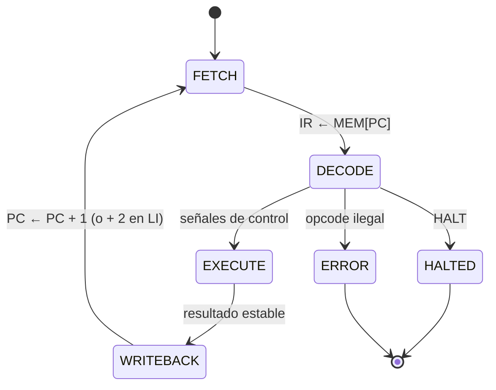

# 04 · Arquitectura del conjunto de instrucciones T754

La ISA T754 es una ISA mínima, diseñada para ejercitar la FPU y la ALU entera del
simulador (ADR-0010).

## 1. Estado arquitectónico

| Elemento | Ancho | Implementación |
|---|---|---|
| F0–F7 | 32 bits cada uno | flip-flops D maestro-esclavo con transmission gates |
| FSR | 32 bits (12 usados) | flip-flops (ADR-0004) |
| PC | índice de palabra | comportamiento en v0.x; compuertas en v1.0 (ADR-0006) |
| Memoria de programa | palabras de 32 bits | modelo en Python |

Al reiniciar: PC = 0, FSR = 0 y F0–F7 = 0.

### Registro FSR

| Bits | 31–12 | 11 | 10 | 9 | 8 | 7–5 | 4 | 3 | 2 | 1 | 0 |
|---|---|---|---|---|---|---|---|---|---|---|---|
| Campo | reservado | N | Z | V | C | reservado | NV | DZ | OF | UF | NX |
| Semántica | 0 | entero | entero | entero | entero | 0 | sticky | sticky | sticky | sticky | sticky |

## 2. Formato de instrucción

```
 31        24 23  21 20  18 17  15 14                     0
┌────────────┬──────┬──────┬──────┬─────────────────────────┐
│   opcode   │  rd  │ rs1  │ rs2  │      reservado (0)      │
└────────────┴──────┴──────┴──────┴─────────────────────────┘
```

Los campos que una instrucción no usa deben valer 0. `LI` ocupa dos palabras:

```
palabra k   : 0x01 | rd | 000 | 000 | 0…0
palabra k+1 : literal binary32 (32 bits)
```

## 3. Repertorio

| Opcode | Mnemónico | Sintaxis | Operación | FSR |
|---|---|---|---|---|
| 0x00 | NOP | `NOP` | — | — |
| 0x01 | LI | `LI Fd, literal` | Fd ← literal | — |
| 0x02 | MOV | `MOV Fd, Fs1` | Fd ← Fs1 | — |
| 0x10 | FADD | `FADD Fd, Fs1, Fs2` | Fd ← Fs1 + Fs2 | flags \|= |
| 0x11 | FSUB | `FSUB Fd, Fs1, Fs2` | Fd ← Fs1 − Fs2 | flags \|= |
| 0x12 | FMUL | `FMUL Fd, Fs1, Fs2` | Fd ← Fs1 × Fs2 | flags \|= |
| 0x13 | FDIV | `FDIV Fd, Fs1, Fs2` | Fd ← Fs1 / Fs2 | flags \|= |
| 0x20 | ADD | `ADD Fd, Fs1, Fs2` | Fd ← Fs1 + Fs2 (entero, C2, módulo 2^32) | CVZN ← |
| 0x21 | SUB | `SUB Fd, Fs1, Fs2` | Fd ← Fs1 − Fs2 (entero, C2, módulo 2^32) | CVZN ← |
| 0x30 | OUT | `OUT Fs1` | salida ← Fs1 | — |
| 0x31 | CLRF | `CLRF` | FSR ← 0 | todo ← 0 |
| 0xFF | HALT | `HALT` | detiene la máquina | — |

Ejemplo de codificación: `FADD F3, F1, F2` →
opcode 0x10, rd = 011, rs1 = 001, rs2 = 010:

```
0001 0000 │ 011 │ 001 │ 010 │ 000 0000 0000 0000
= 0001 0000 0110 0101 0000 0000 0000 0000 = 0x10650000
```

## 4. Ciclo de instrucción



## 5. Lenguaje ensamblador `.t754`

- Una instrucción por línea. Comentarios desde `;` o `#` hasta el fin de línea.
- Mnemónicos y registros sin distinguir mayúsculas de minúsculas (`fadd f1, f2, f3`).
- Operandos separados por comas.
- Literales de `LI`: decimales (`1.5`, `-2.5e-3`, `inf`, `-inf`, `nan`) que se
  redondean a binary32 con RNE, o hexadecimales (`0x3FC00000`) que se toman como bits.
- El binario resultante es una secuencia de palabras de 32 bits en **big-endian**.
- Los errores indican `línea:columna` y la causa, por ejemplo:
  `programa.t754:4:6: registro desconocido 'F9' (se esperaba F0–F7)`.

Ejemplo (evaluación de p(x) = 2x² − 3x + 1 en x = 1.5 por Horner):

```
; p(x) = (2x - 3)x + 1
LI   F1, 1.5        ; x
LI   F2, 2.0
LI   F3, 3.0
LI   F4, 1.0
FMUL F5, F2, F1     ; 2x
FSUB F5, F5, F3     ; 2x - 3
FMUL F5, F5, F1     ; (2x - 3)x
FADD F5, F5, F4     ; + 1
OUT  F5             ; 1.0 (0x3F800000)
HALT
```
