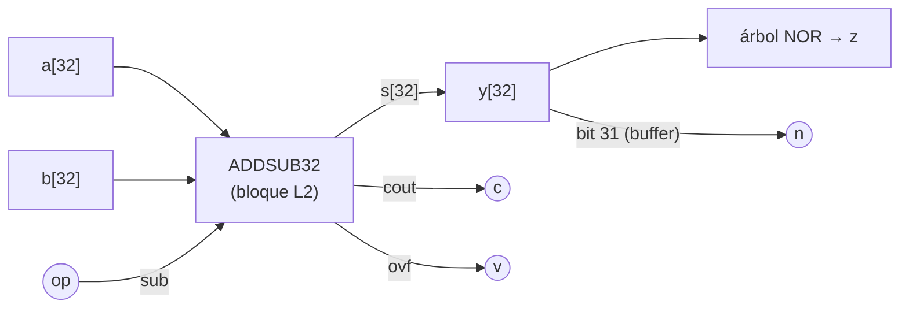

# GUIA · ALU entera de 32 bits

- **Responsable:** Ronald (@devronaldaz)
- **Issue:** #13 · **Hito:** `v0.1.0-avance`
- **Código:** `src/transim/alu/int_alu.py` · **Pruebas:** `tests/alu/`
- **Lecturas previas:** ADR-0004 (bits C, V, Z, N del FSR), ADR-0005, `blocks/GUIA.md`.

## 1. Qué es y por qué existe

La ALU ejecuta las instrucciones enteras `ADD` y `SUB` de la ISA T754 sobre los
registros F0–F7 interpretados como enteros de 32 bits en complemento a 2, y produce los
indicadores que el control escribe en el FSR (bits 8–11).



| Indicador | Significado | Cómo se obtiene |
|---|---|---|
| C | acarreo de salida (en SUB: 1 = sin préstamo, convención ARM) | `cout` del sumador/restador |
| V | desbordamiento con signo | `ovf` del sumador/restador |
| Z | resultado cero | NOR de los 32 bits (árbol de OR2 + INV) |
| N | resultado negativo | bit 31 de y |

## 2. Interfaces que se deben respetar

- `int_alu(width: int = WORD_BITS) -> Netlist`, nombre `ALU{width}`; entradas: buses
  `a[width]`, `b[width]`, `op` (0 = ADD, 1 = SUB); salidas: bus `y[width]`, `c`, `v`,
  `z`, `n`.
- `IntALU(width=WORD_BITS, engine="cached")` con `execute(op, a, b) -> IntResult`: arma
  el `IntResult(value, c, v, z, n)` a partir de `self.evaluate(...)`.
- `OP_ADD = 0`, `OP_SUB = 1`. El ancho por defecto viene de `cpu.isa.WORD_BITS`: no se
  escribe 32 a mano (ADR-0001).

## 3. Tareas

| Orden | Issue | Tarea | Depende de |
|---|---|---|---|
| 1 | #13 | ALU ADD/SUB con C, V, Z, N | #8 (sumador/restador) |

## 4. Puntos de commit

| Punto | Qué debe estar hecho y probado | Mensaje de commit |
|---|---|---|
| C1 | `int_alu` con y, c, v; `test_puertos` en verde | `feat(alu): agrega netlist de la ALU ADD/SUB` |
| C2 | z y n; `IntALU.execute`; pruebas de #13 sin `@pendiente` | `feat(alu): agrega indicadores Z y N y la unidad IntALU` |
| — | **PR de #13** | |

## 5. Criterios de aceptación

- 49 pares de bordes (0, 1, 0x7FFFFFFF, 0x80000000, 0xFFFFFFFF, …) × ADD y SUB y 500
  operaciones aleatorias: 0 discrepancias en valor y en C, V, Z, N contra
  `transim.reference.integer`.
- `make validar M=alu` → **PASS**.

## 6. Cómo validar

```bash
make validar M=alu
```

Lista de verificación manual:

- [ ] 0x7FFFFFFF + 1 → y = 0x80000000, V = 1, N = 1, C = 0.
- [ ] 5 − 7 → y = 0xFFFFFFFE, C = 0 (hubo préstamo), N = 1.
- [ ] 3 − 3 → Z = 1, C = 1.

## 7. Preguntas de comprensión

1. ¿Por qué C y V pueden diferir? Dé un ejemplo de cada combinación. *Pista: enteros
   sin signo frente a con signo.*
2. ¿Por qué en la resta C = 1 significa "no hubo préstamo"? *Pista: A + ¬B + 1.*
3. ¿Cuántos niveles de celda tiene el árbol que calcula Z para 32 bits? *Pista: log₂ 32.*
4. ¿Por qué los indicadores enteros no son acumulativos y los de IEEE 754 sí? *Pista:
   ADR-0004.*
