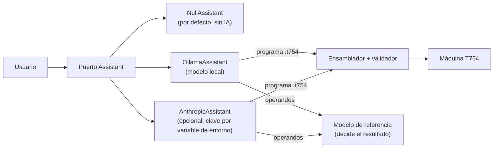

# GUIA · Asistente de IA localizado

- **Responsable:** Héctor (@Hector-0-0)
- **Issue:** #32 · **Hito:** `v0.5.0-parcial`
- **Código:** `src/transim/assistant/` · **Pruebas:** `tests/assistant/`
- **Lecturas previas:** ADR-0012, docs/06_politica_ia.md.

## 1. Qué es y por qué existe

El asistente es un componente **opcional** del software que explica trazas de ejecución,
traduce peticiones en lenguaje natural a programas `.t754` y propone casos borde. Su
regla central: **nunca calcula**. Todo lo que produce pasa por un verificador
determinista (el ensamblador o el modelo de referencia).



## 2. Interfaces que se deben respetar

- Puerto `Assistant` (entregado): `name`, `explain_trace`, `nl_to_program`,
  `propose_edge_cases`.
- `NullAssistant` (entregado).
- `OllamaAssistant(model, url, timeout)`: `POST {url}/api/generate` con
  `{"model", "prompt", "stream": false}`, usando `urllib.request`; quita cercas de código
  de la respuesta; en `propose_edge_cases` interpreta líneas `0x… 0x…` e ignora las demás.
- `AnthropicAssistant(model)`: requiere el extra `ai`; si falta `ANTHROPIC_API_KEY`
  lanza `RuntimeError` que menciona la variable.

## 3. Tareas

| Orden | Issue | Tarea | Depende de |
|---|---|---|---|
| 1 | #32 | Adaptadores Ollama y Anthropic | #29 |

## 4. Puntos de commit

| Punto | Qué debe estar hecho y probado | Mensaje de commit |
|---|---|---|
| C1 | `OllamaAssistant` contra el servidor de prueba local | `feat(ai): agrega adaptador para Ollama` |
| C2 | `AnthropicAssistant`; pruebas de #32 | `feat(ai): agrega adaptador opcional para la API de Anthropic` |
| — | **PR de #32** | |

## 5. Criterios de aceptación

- Las pruebas usan un servidor HTTP local que imita Ollama: no se requiere red.
- Sin la variable de entorno, el adaptador remoto falla con un mensaje claro.
- Todo el sistema y todas las pruebas funcionan con `NullAssistant`.
- `make validar M=ai` → **PASS**.

## 6. Cómo validar

```bash
make validar M=ai
```

- [ ] Ningún resultado numérico mostrado por la GUI o el CLI proviene del asistente.
- [ ] La clave nunca aparece en el repositorio ni en los registros.

## 7. Preguntas de comprensión

1. ¿Por qué el asistente no puede calcular resultados? *Pista: ADR-0012.*
2. ¿Qué es el patrón puertos y adaptadores y qué ventaja da aquí?
3. ¿Cómo se garantiza que un programa propuesto no rompa la máquina?
