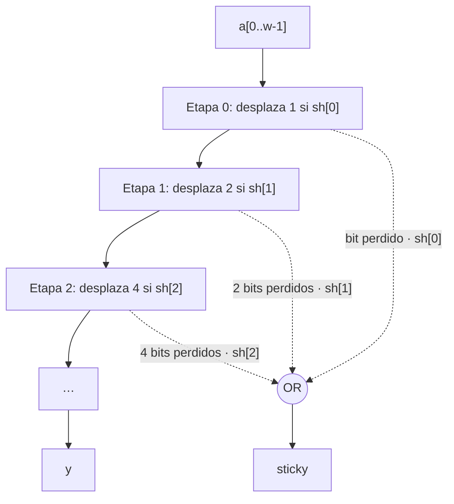

# GUIA · Bloques aritméticos (capa L2)

- **Responsable:** Ronald (@devronaldaz)
- **Issues:** #7 a #12 (avance) y #14 (parcial)
- **Código:** `src/transim/blocks/` · **Pruebas:** `tests/blocks/`
- **Lecturas previas:** ADR-0005, ADR-0009, docs/03_ieee754.md §3, la GUIA de cells.

## 1. Qué es y por qué existe

Los bloques de L2 son los "ladrillos" aritméticos de la ALU entera y de la FPU. Cada uno
es un netlist que instancia celdas de L1; ninguno coloca transistores sueltos.

| Bloque | Lo usa | Para qué |
|---|---|---|
| Sumador (RCA, CLA) | ALU, FPU (mantisas, exponentes, redondeo) | sumar |
| Sumador/restador | ALU, FPU (diferencia de exponentes) | a ± b en complemento a 2 |
| Comparador | FPU (¿\|b\| > \|a\|?) | decidir el intercambio de operandos |
| Multiplexores | FPU (intercambio), banco de registros (lectura) | elegir entre buses |
| Barrel shifter | FPU (alineación, normalización, subnormales) | desplazar k posiciones |
| LZC | FPU (normalización) | cuántas posiciones desplazar |

**Ripple-carry (RCA).** `width` sumadores completos en cadena: el acarreo de salida de
`fa{i}` es el de entrada de `fa{i+1}`. La profundidad crece linealmente con el ancho.

**Restador.** A − B = A + ¬B + 1: cada bit de b pasa por un XOR2 con `sub` (lo invierte
cuando `sub` = 1) y `sub` entra como acarreo inicial. El desbordamiento con signo es el
XOR entre el acarreo que entra al bit de signo y el que sale de él.

**Barrel shifter logarítmico.** ⌈log₂⌉ etapas; la etapa *i* desplaza 2^i posiciones si
`sh[i]` = 1 (una fila de MUX2). En el desplazador a la derecha, la salida **sticky** es el
OR de todo lo que sale por la derecha: en la etapa *i*, los 2^i bits menos
significativos de su entrada, habilitados por `sh[i]`. El sticky total es el OR de las
etapas.



**LZC.** Una forma combinacional directa: por cada posición *j*, h_j = a_j · (todos los
bits superiores son 0) es un *one-hot* del primer 1; `count` es la codificación binaria
de (w − 1 − j). Si a = 0, `count` = w.

**Carry-lookahead (v1).** Con g_i = a_i·b_i y p_i = a_i ⊕ b_i, el acarreo es
c_{i+1} = g_i + p_i·c_i. Desarrollado en bloques de 4 bits con un nivel jerárquico, la
profundidad pasa de lineal a logarítmica a costa de más transistores; la comparación
RCA/CLA es parte del informe (docs/05).

## 2. Interfaces que se deben respetar

| Función | Nombre del netlist | Entradas | Salidas |
|---|---|---|---|
| `ripple_carry_adder(width)` | `RCA{width}` | buses a, b; cin | bus s; cout |
| `carry_lookahead_adder(width)` | `CLA{width}` | igual que RCA | igual que RCA |
| `adder_subtractor(width)` | `ADDSUB{width}` | buses a, b; sub | bus s; cout, ovf |
| `magnitude_comparator(width)` | `CMP{width}` | buses a, b | lt, eq, gt |
| `mux2_bus(width)` | `MUX2x{width}` | buses a, b; s | bus y |
| `mux_n(width, n)` | `MUX{n}x{width}` | buses in0…in{n−1}, sel | bus y |
| `barrel_shifter(width, "left"\|"right")` | `SHL{w}` / `SHR{w}` | buses a, sh | bus y; sticky (solo derecha) |
| `leading_zero_counter(width)` | `LZC{width}` | bus a | bus count |

- `shift_bits_for(width)` y `count_bits_for(width)` (= `width.bit_length()`) ya están
  implementadas: úselas para el ancho de `sh` y de `count`.
- El RCA instancia exactamente `width` celdas `FA` llamadas `fa0`…
- `mux_n` lanza `ValueError` si `n` no es potencia de 2.
- Para una entrada constante use `nl.vdd` o `nl.gnd` como nodo.
- Para exponer como salida suelta un nodo que ya es bit de un bus (por ejemplo, el bit de
  signo como `n`), use `nl.mark_output("n", y[width - 1])`.

## 3. Tareas

| Orden | Issue | Tarea | Depende de |
|---|---|---|---|
| 1 | #7 | RCA | #4 (FA) |
| 2 | #8 | Sumador/restador | #2, #4 |
| 3 | #9 | Comparador | #8 |
| 4 | #10 | MUX2×N y MUX-N | #3 |
| 5 | #11 | Barrel shifter con sticky | #1, #3 |
| 6 | #12 | LZC | #1 |
| 7 | #13 | ALU entera (ver `alu/GUIA.md`) | #8 |
| 8 | #14 | CLA y comparación (hito parcial) | #7 |

**Mientras Jairo termina las celdas:** puede escribir su netlist contra las interfaces de
L1 y probar la lógica con las celdas semilla (NAND2, NOR2, INV) o con la referencia en
`transim.reference.blocks`; en cuanto la celda real se integre en `main`, sus pruebas
pasan sin cambiar su código.

## 4. Puntos de commit

| Punto | Qué debe estar hecho y probado | Mensaje de commit |
|---|---|---|
| C1 | RCA; pruebas de #7 sin `@pendiente` y en verde | `feat(blocks): agrega sumador ripple-carry de N bits` |
| — | **PR de #7** | |
| C2 | Sumador/restador con cout y ovf | `feat(blocks): agrega sumador/restador en complemento a 2` |
| — | **PR de #8** | |
| C3 | Comparador | `feat(blocks): agrega comparador de magnitud` |
| — | **PR de #9** | |
| C4 | MUX2×N y MUX-N | `feat(blocks): agrega multiplexores de bus` |
| — | **PR de #10** | |
| C5 | Barrel shifter a la izquierda | `feat(blocks): agrega barrel shifter a la izquierda` |
| C6 | Barrel shifter a la derecha con sticky | `feat(blocks): agrega barrel shifter a la derecha con sticky` |
| — | **PR de #11** | |
| C7 | LZC; `make validar M=blocks` sin pendientes salvo #14 | `feat(blocks): agrega contador de ceros a la izquierda` |
| — | **PR de #12** | |
| C8 | CLA y tabla de comparación RCA/CLA | `feat(blocks): agrega sumador carry-lookahead` |
| — | **PR de #14** | |

## 5. Criterios de aceptación

- Sumadores y restador: **exhaustivos** para 1 a 4 bits (motor `switch`) y 300 casos
  aleatorios + bordes para 8, 24 y 32 bits (motor `cached`): 0 discrepancias contra
  `transim.reference.blocks`.
- RCA de 8 bits = 8 celdas FA = 224 transistores.
- Comparador exhaustivo en 4 bits; desplazadores exhaustivos en 6 bits (todas las
  combinaciones de a y sh, incluido sh ≥ ancho) y 200 casos en 27 bits; LZC exhaustivo
  en 1, 2, 5 y 8 bits y aleatorio en 24, 27 y 48.
- `make validar M=blocks` → **PASS** (al cerrar #14).

## 6. Cómo validar

```bash
make validar M=blocks
make validar M=blocks COMPLETO=1
```

La salida incluye, por bloque, transistores y conmutaciones medias, por ejemplo
`RCA32  896 T`. Lista de verificación manual:

- [ ] Para el RCA de 4 bits, seguí a mano la propagación del acarreo en 0111 + 0001.
- [ ] Verifiqué con un ejemplo que `ovf` = 1 en 0x7F + 0x01 (8 bits) y `cout` = 0.
- [ ] Con a = 0b1011 y sh = 2, el sticky del desplazador a la derecha es 1.
- [ ] El LZC devuelve el ancho completo cuando a = 0.

## 7. Preguntas de comprensión

1. ¿Por qué el RCA es lento para 32 bits y cuántos niveles de celda tiene su camino
   crítico? *Pista: la cadena de acarreos.*
2. ¿Por qué A − B = A + ¬B + 1? *Pista: definición de complemento a 2.*
3. ¿Cuándo hay desbordamiento con signo y por qué basta con un XOR de dos acarreos?
   *Pista: sumar dos positivos y obtener un negativo.*
4. ¿Por qué el comparador puede usar el acarreo de salida de la resta? *Pista: C = 1
   significa "no hubo préstamo".*
5. ¿Para qué necesita la FPU el sticky del desplazador? *Pista: ADR-0002, bit S.*
6. ¿Por qué el barrel shifter tiene ⌈log₂ n⌉ etapas y no n? *Pista: representación
   binaria del desplazamiento.*
7. ¿Qué cambia entre RCA y CLA en transistores y en profundidad? *Pista: docs/05 §3.*
8. ¿Para qué usa la FPU el LZC? *Pista: resta de números cercanos (cancelación).*
