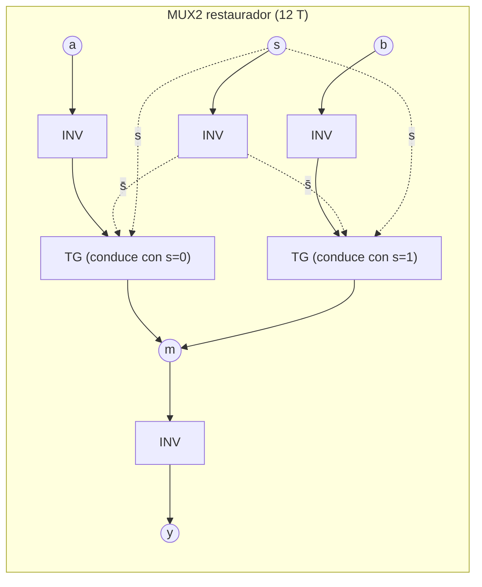
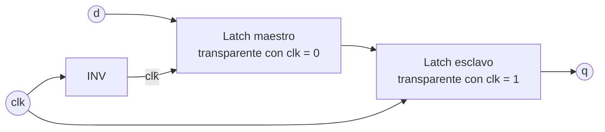

# GUIA · Celdas CMOS (capa L1)

- **Responsable:** Jairo (@JairoHCh)
- **Issues:** #1 a #6 · **Hito:** `v0.1.0-avance`
- **Código:** `src/transim/cells/` · **Pruebas:** `tests/cells/`
- **Lecturas previas:** docs/02_simulador_switch_level.md, ADR-0006, ADR-0007, ADR-0008 (sección "Precisiones"), docs/05_metricas.md §4.

## 1. Qué es y por qué existe

Las celdas son el primer nivel donde los transistores se convierten en funciones lógicas.
Todo lo que construyen los demás integrantes (sumadores, desplazadores, FPU, registros)
se arma instanciando estas celdas, así que su corrección y su número de transistores se
propagan a todo el procesador.

**CMOS estático.** Cada compuerta tiene una red *pull-up* de pMOS hacia VDD y una red
*pull-down* de nMOS hacia GND, complementarias (Weste y Harris, 2011): una conexión en
serie en una red corresponde a una conexión en paralelo en la otra. Para cualquier
combinación de entradas conduce exactamente una de las dos, así que la salida siempre
queda conectada a un riel.

**Transmission gate (TG).** Un nMOS y un pMOS en paralelo, con compuertas
complementarias. Transmite 0 y 1 sin degradación, pero no restaura el nivel: por eso la
biblioteca exige un inversor a la salida de las celdas que usan TG.

**Reglas de la biblioteca (ADR-0008).**

1. *Entradas de alta impedancia:* toda entrada llega solo a compuertas de transistores,
   nunca a un canal (source/drain).
2. *Salidas restauradas:* toda salida la maneja una red CMOS hacia los rieles.
3. Cada constructor combinacional devuelve siempre el mismo objeto (`@cache`) y no debe
   modificarse después de construido.

Con estas reglas cada celda es componible y el motor `cached` puede tabularla.





**Sumador completo espejo (28 T).** Usa la identidad s = ¬(a·b·c + c̄out·(a + b + c)),
con c̄out = ¬(a·b + c·(a + b)). Las redes pull-up y pull-down de cada etapa tienen la
misma topología (de ahí "espejo"):

| Etapa | Pull-down (nMOS) | Pull-up (pMOS) | Transistores |
|---|---|---|---|
| Acarreo → c̄out | (a serie b) ∥ (cin serie (a ∥ b)) | misma topología | 10 |
| Suma → s̄ | (a serie b serie cin) ∥ (c̄out serie (a ∥ b ∥ cin)) | misma topología | 14 |
| Inversores de salida | s = ¬s̄, cout = ¬c̄out | | 4 |

## 2. Interfaces que se deben respetar

Ya existen como stubs en `combinational.py` y `sequential.py`. Nombres de celda, puertos
y conteos no se cambian sin un ADR.

| Constructor | Nombre de celda | Entradas | Salidas | Transistores |
|---|---|---|---|---|
| `inv()` *(entregada)* | `INV` | a | y | 2 |
| `nand2()` *(entregada)* | `NAND2` | a, b | y | 4 |
| `nor2()` *(entregada)* | `NOR2` | a, b | y | 4 |
| `and2()` | `AND2` | a, b | y | 6 (NAND2 + INV) |
| `or2()` | `OR2` | a, b | y | 6 (NOR2 + INV) |
| `xor2()` | `XOR2` | a, b | y | 12 |
| `xnor2()` | `XNOR2` | a, b | y | 12 |
| `mux2()` | `MUX2` | a, b, s | y (= a si s = 0) | 12 |
| `half_adder()` | `HA` | a, b | s, cout | 18 (XOR2 + AND2) |
| `full_adder()` | `FA` | a, b, cin | s, cout | 28, **celda primitiva** (sin sub-instancias) |
| `d_latch()` | `DLATCH` | d, clk | q | libre (sugerido: 12) |
| `dff()` | `DFF` | d, clk | q | libre (sugerido: 26) |
| `register(width)` | `REG{width}` | bus d, clk, en | bus q | libre |

- Las celdas secuenciales se construyen con `Netlist(..., sequential=True)`.
- Sugerencia para el latch: invierta `d` con un INV antes de la TG de entrada; así
  también las celdas secuenciales cumplen la regla 1.
- El orden de los puertos importa: créelos en el orden de la tabla.

## 3. Tareas

| Orden | Issue | Tarea | Depende de |
|---|---|---|---|
| 1 | #1 | AND2 y OR2 | — |
| 2 | #2 | XOR2 y XNOR2 de 12 T | — |
| 3 | #3 | MUX2 restaurador de 12 T | — |
| 4 | #4 | HA y FA espejo de 28 T | #1, #2 |
| 5 | #5 | DLATCH y DFF | — |
| 6 | #6 | REG de N bits con habilitación | #3, #5 |

Cada issue se trabaja en su rama `feat/cells-<descripcion>` y se cierra con su propio PR.

## 4. Puntos de commit

En cada punto: implementar, **quitar los `@pendiente(N)` de las pruebas de ese issue** (en
`test_combinacionales.py`, quitar el número del issue del conjunto `PENDIENTES`), correr
`make test` y `make lint`, y recién entonces hacer el commit.

| Punto | Qué debe estar hecho y probado | Mensaje de commit |
|---|---|---|
| C1 | `and2` y `or2`; pasan las pruebas de #1 | `feat(cells): agrega AND2 y OR2 con NAND2/NOR2 e inversor` |
| — | **PR de #1** (`Closes #1`) | |
| C2 | `xor2` y `xnor2`; pasan las pruebas de #2 | `feat(cells): agrega XOR2 y XNOR2 CMOS de 12 transistores` |
| — | **PR de #2** | |
| C3 | `mux2`; pasan las pruebas de #3 | `feat(cells): agrega MUX2 restaurador de 12 transistores` |
| — | **PR de #3** | |
| C4 | `half_adder` | `feat(cells): agrega medio sumador` |
| C5 | `full_adder` espejo; pasan todas las pruebas de #4 | `feat(cells): agrega sumador completo espejo de 28 transistores` |
| — | **PR de #4** | |
| C6 | `d_latch` y `dff`; pasan las pruebas de #5 | `feat(cells): agrega latch D y flip-flop maestro-esclavo con TG` |
| — | **PR de #5** | |
| C7 | `register(width)`; pasan las pruebas de #6; `make validar M=cells` da PASS | `feat(cells): agrega registro de N bits con habilitación` |
| — | **PR de #6** | |

## 5. Criterios de aceptación

- Tabla de verdad **exhaustiva** (las 2^n combinaciones) de cada celda combinacional con
  el motor `switch`: 0 discrepancias contra `transim.reference.cells`.
- Conteo de transistores **exacto** según la tabla de la sección 2 y nMOS = pMOS.
- Reglas de biblioteca verificadas automáticamente (entradas solo a compuertas, hojas
  tabulables por el motor `cached`).
- Equivalencia `switch`/`cached` con 60 estímulos aleatorios que incluyen X.
- Latch: transparente con clk = 1 y retención con clk = 0. DFF: captura solo en el flanco
  de subida durante 40 ciclos seguidos. Registro: carga con en = 1 y conserva con en = 0
  para 1, 4 y 8 bits.
- `make validar M=cells` → **PASS**.

## 6. Cómo validar

```bash
make validar M=cells
```

Salida esperada al terminar (las cifras de conmutaciones y tiempos pueden variar):

```
== Validación de 'cells': Celdas L1 (Jairo)
[PASS] pruebas (rápidas): 44 passed in 0.6s
[PASS] pendientes en tests/: 0
[PASS] stubs sin implementar en src/: 0
[INFO] métricas (motor cached, 20 estímulos aleatorios):
  INV                      2 T        1.2 conm./estímulo      0.01 ms/estímulo
  ...
  FULL_ADDER              28 T        5.5 conm./estímulo      0.06 ms/estímulo
== RESULTADO: PASS
```

Lista de verificación manual:

- [ ] Dibujé a mano el esquema de transistores de XOR2, MUX2 y FA y coincide con el código.
- [ ] Cada transistor tiene un nombre descriptivo (`pa`, `nb`, `tg_in.n`…).
- [ ] Ningún archivo de otro módulo fue modificado.
- [ ] Las docstrings explican la estructura de cada celda.

## 7. Preguntas de comprensión

1. ¿Por qué en una NAND los pMOS van en paralelo y los nMOS en serie? *Pista: ¿qué
   combinación de entradas debe conectar la salida a GND?*
2. ¿Por qué AND2 tiene 6 transistores y no 4? *Pista: en CMOS estático una sola etapa
   solo produce funciones invertidas.*
3. ¿Qué pasaría si el MUX2 no tuviera el inversor de salida y se encadenaran cinco en el
   barrel shifter? *Pista: transmission gates en serie, resistencia y restauración de
   nivel; ADR-0008.*
4. En el sumador espejo, ¿por qué la etapa de suma puede usar c̄out como entrada?
   *Pista: escriba la tabla de s en función de c̄out y de a + b + c.*
5. ¿Qué es el nodo `n1` de la NAND2 y por qué puede "retener carga"? *Pista: docs/02 §2.4.*
6. ¿Por qué un latch no es lo mismo que un flip-flop? *Pista: transparencia frente a
   disparo por flanco.*
7. ¿Por qué el motor `cached` nunca tabula un latch? *Pista: su salida depende de la
   historia, no solo de las entradas actuales.*
8. ¿Cuántos transistores tiene un registro de 32 bits con su diseño y de dónde sale cada
   término? *Pista: DFF + MUX2 por bit.*

## Referencia

Weste, N. H. E., & Harris, D. M. (2011). *CMOS VLSI design: A circuits and systems
perspective* (4.ª ed.). Addison-Wesley.
