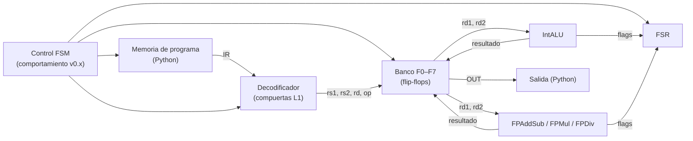

# GUIA · CPU T754 (capa L4)

- **Responsable:** Héctor (@Hector-0-0)
- **Issues:** #29 (avance), #30 (parcial)
- **Código:** `src/transim/cpu/` · **Pruebas:** `tests/cpu/`
- **Lecturas previas:** docs/04_isa_t754.md, ADR-0004, ADR-0006, ADR-0010.

## 1. Qué es y por qué existe

La CPU da contexto a las unidades aritméticas: lee instrucciones de la memoria de
programa, las decodifica con compuertas, lee operandos del banco de registros de
flip-flops, ejecuta en la ALU o la FPU y escribe el resultado y los flags.



| Módulo | Contenido | Nivel (ADR-0006) |
|---|---|---|
| `isa.py` | opcodes, campos, `encode`/`decode` (completo) | especificación |
| `assembler.py` | `.t754` → palabras; errores con línea y columna | software |
| `decoder.py` | `instruction_decoder()` | compuertas |
| `registers.py` | `register_file()` | flip-flops (transistores) |
| `control.py` | `ControlFSM` | comportamiento en v0.x |
| `machine.py` | `Machine`: integra todo | — |

## 2. Interfaces que se deben respetar

- `assemble(source, *, filename, fmt) -> list[int]`, `AssemblyError(filename, line,
  column, message)`, `to_bytes`, `from_bytes`, `disassemble` (ver docstrings).
- `instruction_decoder()`: bus `ir[32]`; salidas one-hot por opcode en minúsculas,
  `illegal`, buses `rd`, `rs1`, `rs2`, y señales de control.
- `register_file(n_regs, width)`: bus `wd`, bus `wa`, `we`, `clk`, buses `ra1`, `ra2` →
  buses `rd1`, `rd2`.
- `ControlFSM.advance(*, halt=False) -> Phase`.
- `Machine(program, fmt, engine)` con `state`, `step()` y `run(max_steps)`; el estado es
  un `reference.machine.MachineState`, para compararlo directamente con la referencia.

## 3. Tareas

| Orden | Issue | Tarea | Depende de |
|---|---|---|---|
| 1 | #29 | Ensamblador | — |
| 2 | #31 | CLI `calc`, `asm`, `run` (ver `ui/cli.py`) | #17, #29 |
| 3 | #30 | Decodificador, banco de registros, control y máquina | #6, #10, #13, #17 |

## 4. Puntos de commit

| Punto | Qué debe estar hecho y probado | Mensaje de commit |
|---|---|---|
| C1 | analizador léxico y sintáctico, errores con posición | `feat(cpu): agrega analizador del ensamblador T754` |
| C2 | literales de LI, binario big-endian y desensamblador; pruebas de #29 | `feat(cpu): completa ensamblador con literales y desensamblador` |
| — | **PR de #29** | |
| C3 | decodificador de compuertas | `feat(cpu): agrega decodificador de instrucciones con compuertas` |
| C4 | banco de registros de flip-flops | `feat(cpu): agrega banco de registros F0–F7` |
| C5 | control y máquina; pruebas de #30 | `feat(cpu): integra la máquina T754 con datapath de transistores` |
| — | **PR de #30** | |

## 5. Criterios de aceptación

- Ensamblador: los 4 programas de `examples/` producen exactamente el código esperado;
  6 tipos de error con línea, columna y mensaje exactos; ida y vuelta binario y
  desensamblado.
- Decodificador: cada opcode activa solo su línea; 3 palabras ilegales activan `illegal`.
- Banco de registros: escritura y lectura de 4 registros; `we` = 0 no escribe.
- Máquina: para los 4 programas, mismo estado final (registros, FSR, salidas, PC) que
  `reference.machine.run`.
- `make validar M=cpu` → **PASS**.

## 6. Cómo validar

```bash
make validar M=cpu
transim run examples/horner.t754
```

Lista de verificación manual:

- [ ] Un error en la línea 4 de un archivo se muestra como `archivo:4:columna: mensaje`.
- [ ] `transim run examples/casos_especiales.t754` muestra FSR = 0x18 (NV | DZ).

## 7. Preguntas de comprensión

1. ¿Por qué `LI` ocupa dos palabras? *Pista: 32 bits de literal más el opcode.*
2. ¿Qué hace el decodificador con una palabra cuyo opcode no existe?
3. ¿Por qué el banco de registros es secuencial y el decodificador combinacional?
4. ¿En qué fase se actualiza el FSR y por qué los flags de punto flotante se acumulan?
5. ¿Qué partes de la CPU son de comportamiento en v0.x y por qué es aceptable
   declararlo? *Pista: ADR-0006.*
