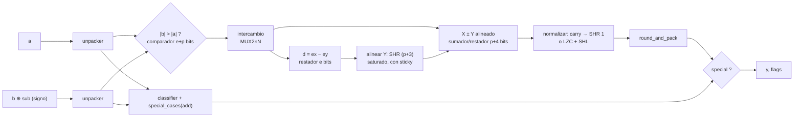

# GUIA · FPU común y FADD/FSUB (capa L3)

- **Responsable:** Daniel (@Sergiodam73)
- **Issues:** #15, #16, #17 · **Hito:** `v0.1.0-avance` (es la operación de la demo)
- **Código:** `src/transim/fpu/{codec,special,rounding,add_sub}.py`
- **Pruebas:** `tests/fpu/test_codec_especiales.py`, `test_redondeo.py`, `test_suma_resta.py`
- **Lecturas previas:** docs/03_ieee754.md completo (en especial el ejemplo 2 y §6),
  ADR-0001 a ADR-0004, ADR-0009, `blocks/GUIA.md`.

## 1. Qué es y por qué existe

FADD/FSUB es la operación central del avance: debe calcularse completamente en
transistores y coincidir bit a bit (y en flags) con IEEE 754. Además, el bloque
`round_and_pack` es **compartido**: lo usarán FMUL y FDIV (Fabricio), así que su
interfaz debe quedar estable pronto.



### Datapath recomendado (p = precisión, e = bits de exponente)

1. **Desempaquetar** a y b con `unpacker`: signo, exponente efectivo (E, o 1 si E = 0) y
   mantisa de p bits con el bit implícito. El signo efectivo de b es `sb ⊕ sub`.
2. **Ordenar por magnitud:** compare {exp, mant} de a y b como enteros sin signo de
   e + p bits; si |b| > |a|, intercambie. Llame X al mayor e Y al menor.
3. **Diferencia de exponentes:** d = ex − ey ≥ 0 (restador de e bits).
4. **Alinear:** Y con tres ceros a la derecha (p + 3 bits) se desplaza d posiciones a la
   derecha con el barrel shifter. Si d no cabe en `shift_bits_for(p + 3)` bits,
   **sature** (todos los bits de desplazamiento en 1): todo sale y queda en el sticky. El
   bit menos significativo alineado se combina con el sticky (OR) para formar S.
5. **Operación efectiva:** eop = sx ⊕ sy; si eop = 0 suma, si eop = 1 resta X − Y. Use
   un sumador/restador de p + 4 bits (uno extra para el acarreo).
6. **Signo:** el de X; si el resultado es exactamente 0, el signo es `sa · sb_efectivo`
   (así x − x = +0 y (−0) + (−0) = −0, ADR-0003).
7. **Normalizar:** si hubo acarreo, desplace 1 a la derecha (acumulando el bit que sale en
   S) y sume 1 al exponente; si no, cuente ceros con el LZC, desplace a la izquierda y
   reste esa cantidad. El exponente sesgado del bit más significativo es
   `ex + 1 − lz` en complemento a 2 de e + 2 bits (puede quedar ≤ 0: lo resuelve
   `round_and_pack`).
8. **Redondear y empaquetar** con `round_and_pack`: m = p bits superiores, luego G, R, y
   S = OR del resto.
9. **Casos especiales:** si `special` = 1, la salida es la del bloque especial (y sus
   flags); si no, la del datapath numérico.

¿Por qué bastan 3 bits extra? Ver ADR-0002 (Consecuencias).

Este datapath se verificó con un modelo numérico que sigue exactamente estos pasos (mismos
anchos, saturación, LZC y fórmulas de exponente) frente a la referencia: 22 116 pares
(todos los bordes y 20 000 aleatorios) × 4 operaciones × 2 formatos, 0 discrepancias.

## 2. Interfaces que se deben respetar

| Función | Nombre | Entradas | Salidas |
|---|---|---|---|
| `unpacker(fmt)` | `UNPACK_{fmt}` | bus x | sign; buses exp[e], mant[p] |
| `classifier(fmt)` | `CLASS_{fmt}` | bus x | zero, subnormal, normal, inf, qnan, snan (one-hot) |
| `special_cases(fmt, op)` | `SPECIAL_{op}_{fmt}` | a_zero, a_inf, a_qnan, a_snan, a_sign y lo mismo con b_ | special; bus y; invalid, div_by_zero |
| `round_and_pack(fmt)` | `ROUND_{fmt}` | sign; bus e[e+2]; bus m[p]; g, r, s | bus y; overflow, underflow, inexact |
| `fp_add_sub(fmt)` | `FADDSUB_{fmt}` | buses a, b; sub | bus y; invalid, overflow, underflow, inexact |

- **Contrato exacto de `round_and_pack`:** `transim.reference.fpu.round_and_pack`. El bus
  `e` es el exponente **sesgado del bit más significativo de m**, en complemento a 2 de
  `exponent_width(fmt)` = e + 2 bits.
- En `special_cases(fmt, "add")` los ceros **no** son especiales (los resuelve el
  datapath); solo NaN e ∞.
- `FPAddSub(fmt, engine)` ya está implementada: solo hay que construir el netlist.
- Opcional, recomendado para la demo: buses de depuración `dbg_exp_diff`, `dbg_aligned`,
  `dbg_sum`, `dbg_lz` marcados como salidas; el CLI los muestra con `--trace`.
- `fpu/format.py` es de solo lectura: cualquier cambio requiere un ADR.

## 3. Tareas

| Orden | Issue | Tarea | Depende de |
|---|---|---|---|
| 1 | #15 | `unpacker`, `classifier`, `special_cases` | #1 |
| 2 | #16 | `round_and_pack` (compartido con Fabricio) | #8, #11 |
| 3 | #17 | `fp_add_sub` | #9, #11, #12, #15, #16 |

**Coordinación:** el viernes, revisar con Fabricio el contrato de `round_and_pack`
(entradas, anchos y casos diminutos) usando la referencia; su interfaz no cambia sin ADR.

**Trabajo en paralelo:** mientras no estén los bloques de Ronald, construya cada etapa como
función que devuelve un netlist y pruébela con la referencia (`transim.reference.blocks`
y `transim.reference.fpu`). El orden de commits de abajo lo permite.

## 4. Puntos de commit

| Punto | Qué debe estar hecho y probado | Mensaje de commit |
|---|---|---|
| C1 | `unpacker` | `feat(fpu-common): agrega desempaquetado de operandos` |
| C2 | `classifier` | `feat(fpu-common): agrega clasificador de valores` |
| C3 | `special_cases` para add, mul y div; pruebas de #15 en verde | `feat(fpu-common): agrega resultados de casos especiales` |
| — | **PR de #15** | |
| C4 | `round_and_pack` para normales (sin desnormalizar) | `feat(fpu-common): agrega redondeo RNE con G, R y S` |
| C5 | desnormalización, overflow, underflow; pruebas de #16 en verde | `feat(fpu-common): agrega subnormales, overflow y underflow al redondeo` |
| — | **PR de #16** (avisar a Fabricio) | |
| C6 | FADD de operandos normales con el mismo signo | `feat(fpu-addsub): agrega alineación y suma de mantisas` |
| C7 | resta efectiva, cancelación y normalización con LZC | `feat(fpu-addsub): agrega resta efectiva y normalización` |
| C8 | casos especiales integrados; pruebas de #17 en verde | `feat(fpu-addsub): integra casos especiales en FADD/FSUB` |
| C9 | criterio de aceptación completo (`COMPLETO=1`) | `test(fpu-addsub): verifica 10 000 casos y bordes contra el oráculo` |
| — | **PR de #17** | |

## 5. Criterios de aceptación

- Desempaquetado y clasificador: todos los valores borde de binary16 y binary32;
  clasificador **exhaustivo** en binary16 (65 536 valores, prueba lenta).
- `special_cases`: las 64 combinaciones de 8 representantes de clase × 3 operaciones
  coinciden con la referencia.
- `round_and_pack`: 300 casos (rápida) y 10 000 casos (lenta) por formato, cubriendo
  normales, diminutos, desbordamiento y empates: 0 discrepancias contra la referencia.
- FADD/FSUB: los cuatro ejemplos de docs/03; en binary16 y binary32, **todos los pares
  de casos borde (más de 2 000) y 10 000 pares aleatorios**, para suma y resta: **0
  discrepancias bit a bit, incluidos los cinco flags**, contra el oráculo.
- Mismo resultado con los motores `switch` y `cached` en binary16.
- `make validar M=fpu-addsub COMPLETO=1` → **PASS**.

## 6. Cómo validar

```bash
make validar M=fpu-addsub
make validar M=fpu-addsub COMPLETO=1
```

Una discrepancia se reporta así (bits y campos), lo que permite seguirla a mano:

```
binary32: 0x3fc00000 + 0x40100000
  obtenido: 0x40600000 (s=0 e=0x80 f=0x600000, normal) flags —
  esperado: 0x40700000 (s=0 e=0x80 f=0x700000, normal) flags —
```

Lista de verificación manual:

- [ ] Reproduje en el simulador los ejemplos 2 y 3 de docs/03 y seguí los buses `dbg_`.
- [ ] Probé x − x, (−0) + (−0), ∞ − ∞ y qNaN + 1.
- [ ] Probé una resta con cancelación masiva (1.0 − 0.99999994) y una suma de subnormales.

## 7. Preguntas de comprensión

1. ¿Por qué se alinea el operando menor y no el mayor? *Pista: ¿qué bits se pierden?*
2. ¿Qué representa cada uno de G, R y S y por qué basta un solo bit de sticky? *Pista:
   ADR-0002.*
3. Explique el ejemplo 3 de docs/03: ¿por qué 2^24 + 1 da 2^24 pero (2^24 + 2) + 1 da
   2^24 + 4?
4. ¿Por qué x − x = +0 y no −0? *Pista: IEEE 754-2019 §6.3, modo RNE.*
5. ¿Cuándo la normalización desplaza a la izquierda más de una posición y por qué en ese
   caso el resultado antes de redondear es exacto?
6. ¿Por qué el exponente del desempaquetado de un subnormal es 1 y no 0?
7. ¿Qué diferencia hay entre detectar la tininess antes o después de redondear? *Pista:
   ADR-0004 y el caso fijado en `tests/reference/test_ref_fpu.py`.*
8. ¿Por qué un sNaN levanta invalid y un qNaN no?
