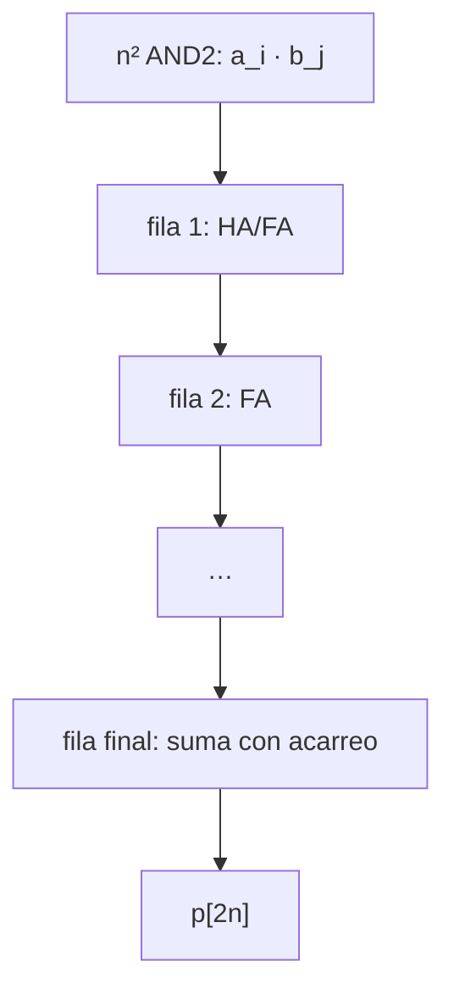

# GUIA · FMUL y FDIV (capa L3)

- **Responsable:** Fabricio (@Fabrizzio-07)
- **Issues:** #18 (avance), #19, #20, #21 (parcial)
- **Código:** `src/transim/fpu/mul.py`, `src/transim/fpu/div.py`
- **Pruebas:** `tests/fpu/test_multiplicacion.py`, `tests/fpu/test_division.py`
- **Lecturas previas:** docs/03_ieee754.md (ejemplos 4, 5 y 6, §6), ADR-0002, ADR-0003,
  ADR-0004, ADR-0009, `fpu/GUIA_ADDSUB.md` (interfaz de `round_and_pack`).

## 1. Qué es y por qué existe

La multiplicación y la división completan las cuatro operaciones del enunciado. Son las
unidades más grandes del procesador (≈ 20 000 y ≈ 27 000 transistores estimados), por
lo que también son las que más aportan a las métricas.

### Multiplicador de mantisas en arreglo

El producto de dos números de n bits es la suma de n productos parciales
a · b_j · 2^j. Cada bit de producto parcial es una AND2 (n² compuertas) y las filas se
acumulan con sumadores completos (y medios sumadores en los extremos).



### Divisor no restaurador

Con el resto parcial R (inicialmente a), cada fila decide un bit de cociente: si R ≥ 0 se
resta el divisor y el bit es 1; si R < 0 se suma y el bit es 0, sin "restaurar" el resto
(Koren, 2002). Cada celda de una fila es un XOR2 (que invierte b según la operación) más
un FA. Tras la última fila, el resto se corrige si es negativo, y `sticky` = resto ≠ 0.

### FMUL (p = precisión, e = bits de exponente)

1. Desempaquetar; signo = sa ⊕ sb; `special_cases(fmt, "mul")`.
2. P = ma × mb con `array_multiplier(p)` (2p bits).
3. lz = LZC(P) sobre 2p bits (cubre operandos subnormales).
4. Exponente sesgado del bit más significativo: **e = ea + eb − sesgo + 1 − lz**
   (aritmética de e + 2 bits en complemento a 2).
5. Desplazar P a la izquierda lz posiciones: m = p bits superiores, G y R los dos
   siguientes, S = OR del resto.
6. `round_and_pack`; elegir entre especial y numérico.

### FDIV

1. Desempaquetar; signo; `special_cases(fmt, "div")`.
2. Normalizar cada mantisa con LZC + desplazador y restar lz a su exponente.
3. q, sticky = `nonrestoring_divider(p, quotient_bits(fmt))` con q_bits = p + 3.
4. Si el bit más alto de q es 1: m = sus p bits superiores, G, R siguientes y S = OR del
   bit restante y del sticky; e = ea' − eb' + sesgo. Si es 0: use los bits desde el
   siguiente (desplazamiento de 1) y e = ea' − eb' + sesgo − 1.
5. `round_and_pack`; elegir entre especial y numérico.

Los anchos de e + 2 bits alcanzan para todos los casos intermedios: verifíquelo con los
extremos (operando subnormal mínimo y normal máximo).

Este datapath se verificó con un modelo numérico que sigue exactamente estos pasos (mismos
anchos, saturación, LZC y fórmulas de exponente) frente a la referencia: 22 116 pares
(todos los bordes y 20 000 aleatorios) × 4 operaciones × 2 formatos, 0 discrepancias.

## 2. Interfaces que se deben respetar

| Función | Nombre | Entradas | Salidas |
|---|---|---|---|
| `array_multiplier(width)` | `ARRMUL{width}` | buses a, b | bus p[2·width] |
| `fp_multiplier(fmt)` | `FMUL_{fmt}` | buses a, b | bus y; invalid, overflow, underflow, inexact |
| `nonrestoring_divider(width, q_bits)` | `NRDIV{width}x{q_bits}` | buses a, b (bit alto en 1) | bus q[q_bits]; sticky |
| `fp_divider(fmt)` | `FDIV_{fmt}` | buses a, b | bus y; invalid, div_by_zero, overflow, underflow, inexact |

- `quotient_bits(fmt)` = p + 3 ya está implementada.
- Contrato del divisor: q = ⌊a · 2^(q_bits − 1) / b⌋, sticky = resto ≠ 0
  (`transim.reference.blocks.divide_mantissas`).
- `FPMul` y `FPDiv` ya están implementadas: solo hay que construir los netlists.
- El multiplicador en arreglo usa exactamente width² celdas `AND2`.
- `round_and_pack` lo mantiene Daniel: no se modifica; si hace falta un cambio, se
  acuerda con él y se documenta en un ADR.

## 3. Tareas

| Orden | Issue | Tarea | Depende de |
|---|---|---|---|
| 1 | #18 | multiplicador en arreglo | #1, #4 |
| 2 | #20 | divisor no restaurador | #8 |
| 3 | #19 | FMUL | #12, #15, #16, #18 |
| 4 | #21 | FDIV | #15, #16, #20 |

**Coordinación:** el viernes, revisar con Daniel el contrato de `round_and_pack`. Mientras
no exista, pruebe su datapath llamando a `transim.reference.fpu.round_and_pack` con las
mismas entradas (m, G, R, S, e) que luego recibirá el bloque.

## 4. Puntos de commit

| Punto | Qué debe estar hecho y probado | Mensaje de commit |
|---|---|---|
| C1 | productos parciales y primera fila | `feat(fpu-muldiv): agrega productos parciales del multiplicador` |
| C2 | multiplicador completo; pruebas de #18 en verde | `feat(fpu-muldiv): agrega multiplicador de mantisas en arreglo` |
| — | **PR de #18** | |
| C3 | fila de suma/resta controlada | `feat(fpu-muldiv): agrega fila del divisor no restaurador` |
| C4 | divisor completo con corrección y sticky; pruebas de #20 | `feat(fpu-muldiv): agrega divisor no restaurador de mantisas` |
| — | **PR de #20** | |
| C5 | FMUL de normales | `feat(fpu-muldiv): agrega FMUL para operandos normales` |
| C6 | subnormales y casos especiales; pruebas de #19 | `feat(fpu-muldiv): completa FMUL con subnormales y casos especiales` |
| — | **PR de #19** | |
| C7 | FDIV de normales | `feat(fpu-muldiv): agrega FDIV para operandos normales` |
| C8 | subnormales, división entre cero y especiales; pruebas de #21 | `feat(fpu-muldiv): completa FDIV con subnormales y casos especiales` |
| C9 | aceptación completa | `test(fpu-muldiv): verifica 10 000 casos y bordes contra el oráculo` |
| — | **PR de #21** | |

## 5. Criterios de aceptación

- Multiplicador: **exhaustivo** para 1 a 4 bits; 100 casos + extremos para 11 y 24 bits;
  24² = 576 celdas AND2.
- Divisor: **exhaustivo** sobre mantisas normalizadas de 2 a 4 bits; 60 casos + extremos
  para p = 11 y p = 24.
- FMUL y FDIV: ejemplos 4, 5 y 6 de docs/03; en binary16 y binary32, todos los pares de
  casos borde y 10 000 pares aleatorios: **0 discrepancias bit a bit, incluidos los
  flags**, contra el oráculo.
- `make validar M=fpu-muldiv COMPLETO=1` → **PASS**.

## 6. Cómo validar

```bash
make validar M=fpu-muldiv
make validar M=fpu-muldiv COMPLETO=1
```

Lista de verificación manual:

- [ ] Reproduje el ejemplo 4 (resultado subnormal con empate a par) y seguí G, R y S.
- [ ] Reproduje 1/3 (ejemplo 5): G = 1, R = 0, S = 1.
- [ ] Probé 0 × ∞, 1/0, −1/+0, 0/0 e ∞/∞.
- [ ] Anoté transistores y tiempo por operación de FMUL y FDIV para el informe.

## 7. Preguntas de comprensión

1. ¿Cuántos productos parciales tiene un multiplicador de 24 × 24 y cuántas AND2?
2. ¿Por qué el producto de dos mantisas normalizadas tiene su bit más alto en la posición
   2p − 1 o 2p − 2? *Pista: [1, 2) × [1, 2) = [1, 4).*
3. ¿Por qué el cociente de dos mantisas normalizadas está en (1/2, 2) y qué implica para
   el número de bits de cociente?
4. ¿Qué significa "no restaurador"? ¿Qué se ahorra respecto del método restaurador?
5. ¿Por qué un resto distinto de cero basta como sticky en la división?
6. ¿Cómo se calcula el exponente de un producto y por qué se resta el sesgo una vez?
7. ¿Por qué 1/0 levanta divideByZero pero ∞/0 no levanta nada?
8. ¿Cómo afecta un operando subnormal a la normalización del producto?

## Referencia

Koren, I. (2002). *Computer arithmetic algorithms* (2.ª ed.). A K Peters.
