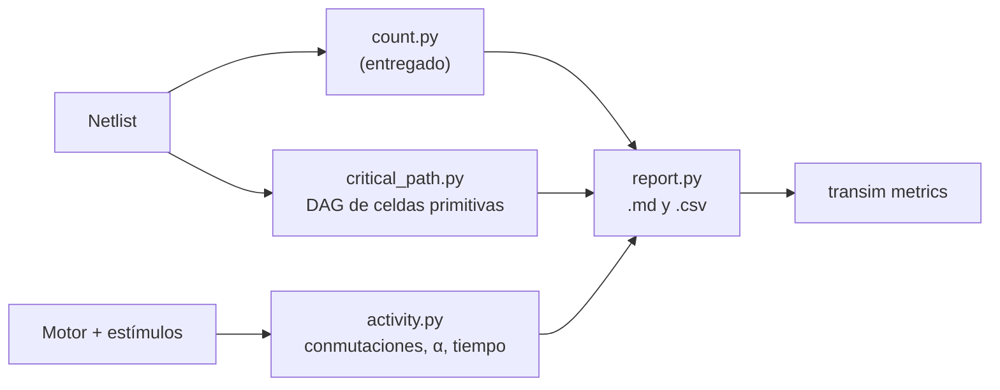

# GUIA · Métricas

- **Responsable:** Yenny (@yennyestherchavez)
- **Issues:** #22, #23, #24 · **Hito:** `v0.1.0-avance`
- **Código:** `src/transim/metrics/` · **Pruebas:** `tests/metrics/`
- **Lecturas previas:** docs/05_metricas.md, ADR-0007 (punto 9), ADR-0013.

## 1. Qué es y por qué existe

Las métricas convierten el simulador en un instrumento de medición: cuántos transistores
tiene cada módulo, cuánto conmuta por operación (aproximación de la potencia dinámica
P ≈ α·C·V²·f) y qué tan profundo es su camino crítico. Las tablas del informe y de las
diapositivas salen de aquí, no se copian a mano.

`metrics/count.py` (conteo de transistores) ya está entregado. Faltan actividad, camino
crítico y reportes.



**Actividad.** Se ponen a cero los contadores del motor, se aplican los estímulos y se
leen `stats()`. α = conmutaciones / (nodos internos × operaciones). La regla de conteo
(estados estables, valores manejados) ya la implementa el núcleo.

**Camino crítico.** Se forma un grafo dirigido cuyos vértices son las celdas primitivas
combinacionales (`netlist.leaf_instances()` no secuenciales): hay arista de A a B si una
salida de A es una entrada de B. El camino crítico es el camino más largo de ese grafo
acíclico (programación dinámica en orden topológico). Las celdas secuenciales cortan el
camino.

## 2. Interfaces que se deben respetar

- `measure_activity(engine, stimuli) -> ActivityReport` (campos: operations, nodes,
  node_toggles, transistor_events, alpha, seconds). `ValueError` si no hay estímulos.
- `critical_path(netlist) -> list[str]` (caminos de instancia en orden) y
  `cell_depth(netlist) -> int`. `ValueError` si hay un ciclo combinacional.
- `generate_reports(out_dir) -> list[Path]`: escribe `transistores`, `actividad`,
  `camino_critico` y `comparacion_sumadores` en `.md` y `.csv`. El CSV de transistores
  tiene las columnas `modulo, nmos, pmos, total`. Los módulos aún no implementados
  (`NotImplementedError`) se omiten con una nota.
- Subcomando `transim metrics --out DIR` en `ui/cli.py` (coordinar con Héctor).

## 3. Tareas

| Orden | Issue | Tarea | Depende de |
|---|---|---|---|
| 1 | #22 | Actividad | — |
| 2 | #23 | Camino crítico | — |
| 3 | #24 | Reportes y `transim metrics` | #22, #23 |

## 4. Puntos de commit

| Punto | Qué debe estar hecho y probado | Mensaje de commit |
|---|---|---|
| C1 | `measure_activity`; pruebas de #22 | `feat(metrics): agrega medición de actividad por operación` |
| — | **PR de #22** | |
| C2 | grafo de celdas | `feat(metrics): construye el grafo de celdas primitivas` |
| C3 | camino más largo; pruebas de #23 | `feat(metrics): agrega profundidad del camino crítico` |
| — | **PR de #23** | |
| C4 | `generate_reports` | `feat(metrics): agrega reportes en Markdown y CSV` |
| C5 | subcomando del CLI; pruebas de #24 | `feat(cli): agrega el subcomando transim metrics` |
| — | **PR de #24** | |

## 5. Criterios de aceptación

- Actividad de una cadena de 5 inversores con 4 estímulos: 18 conmutaciones y 30
  eventos de transistor exactos; α según la fórmula.
- Profundidad: cadena de n inversores = n; dos ramas → la larga; jerarquía de dos
  niveles → 6.
- Reportes: los 8 archivos existen y el CSV de transistores incluye `INV` con 2.
- `make validar M=metrics` → **PASS**.

## 6. Cómo validar

```bash
make validar M=metrics
transim metrics --out /tmp/metricas && ls /tmp/metricas
```

Lista de verificación manual:

- [ ] La tabla `comparacion_sumadores.md` muestra más transistores y menos profundidad
      para el CLA que para el RCA (cuando #14 esté terminado).
- [ ] Las tablas se pegan sin cambios en el informe.

## 7. Preguntas de comprensión

1. ¿Por qué el simulador no puede dar la potencia en vatios? *Pista: C, V y f.*
2. ¿Por qué no se cuentan los glitches? *Pista: retardo cero, ADR-0007 punto 9.*
3. ¿Por qué la profundidad en niveles de celda es solo una aproximación del retardo?
4. ¿Qué es un orden topológico y por qué existe en un circuito combinacional?
5. ¿Qué esperaría observar en α al comparar RCA y CLA?
