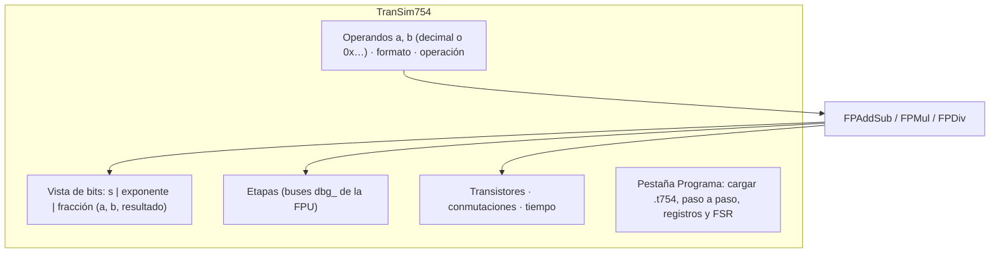

# GUIA · Interfaz gráfica (capa L5)

- **Responsable:** Yenny (@yennyestherchavez)
- **Issues:** #25 (avance), #26 (parcial)
- **Código:** `src/transim/ui/gui/` · **Pruebas:** `tests/ui/test_gui.py`
- **Instalación:** `make install-gui` (instala PySide6, ADR-0011).
- **Lecturas previas:** docs/01_arquitectura.md, docs/03_ieee754.md §1–§2, docs/05.

## 1. Qué es y por qué existe

La GUI es la cara del proyecto en la exposición: permite ingresar dos operandos, ver sus
bits separados en signo, exponente y fracción, ejecutar la operación **en la FPU de
transistores** y mostrar el resultado, los flags, las etapas y cuántos transistores y
conmutaciones intervinieron.



Recomendaciones de diseño:

- La GUI solo **muestra**: todo cálculo lo hacen las unidades de hardware
  (`FPAddSub`, `FPMul`, `FPDiv`) o la máquina; la conversión de texto a bits usa
  `transim.reference.fpu.from_decimal`.
- Ejecute las operaciones largas fuera del hilo de la interfaz (`QThread` o
  `QThreadPool`) para que la ventana no se congele.
- Mientras FMUL/FDIV no estén terminadas, deshabilite esas operaciones con un aviso.

## 2. Interfaces que se deben respetar

- `create_window() -> QMainWindow`: construye la ventana sin mostrarla; su título
  contiene "TranSim754".
- `main() -> int`: crea `QApplication`, muestra la ventana y entra al bucle de eventos.
- Subcomando `transim gui` en `ui/cli.py` llama a `main()` (coordinar con Héctor).

## 3. Tareas

| Orden | Issue | Tarea | Depende de |
|---|---|---|---|
| 1 | #25 | Ventana principal: operandos, vista de bits, resultado y flags | — |
| 2 | #26 | Etapas, métricas y pestaña de programas | #25, #30 |

## 4. Puntos de commit

| Punto | Qué debe estar hecho y probado | Mensaje de commit |
|---|---|---|
| C1 | ventana vacía con título y diseño; prueba de #25 | `feat(gui): agrega ventana principal` |
| C2 | entrada de operandos y vista de bits | `feat(gui): agrega entrada de operandos y vista de bits` |
| C3 | ejecución en la FPU, resultado y flags | `feat(gui): muestra resultado y flags de la FPU` |
| — | **PR de #25** | |
| C4 | etapas y métricas | `feat(gui): muestra etapas y métricas de la operación` |
| C5 | pestaña de programas | `feat(gui): agrega ejecución de programas .t754` |
| — | **PR de #26** | |

## 5. Criterios de aceptación

- La prueba automática construye la ventana en modo `offscreen`.
- Con 1.5 + 2.25 en binary32 se ven los bits de `0x3FC00000`, `0x40100000` y
  `0x40700000`, y flags vacíos; con 1 / 0 se ve +∞ y DZ.
- La ventana no se congela durante una operación.
- `make validar M=gui` → **PASS** (con PySide6 instalado).

## 6. Cómo validar

```bash
make install-gui
make validar M=gui
make gui
```

- [ ] Capturas de pantalla para las diapositivas (operación normal, subnormal, especial).

## 7. Preguntas de comprensión

1. ¿Por qué la GUI no debe calcular nada por su cuenta?
2. ¿Qué pasa si se ejecuta una operación larga en el hilo de la interfaz?
3. ¿Cómo se ve en bits un número subnormal y en qué se diferencia de uno normal?
